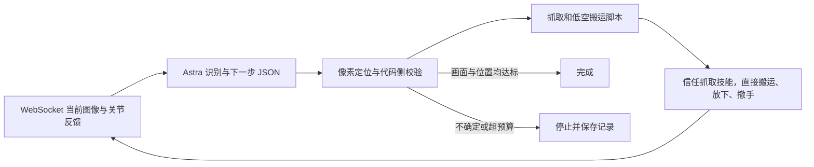

# API + WebSocket 自闭环原型

入口：`closed_loop_spell.py`。当前限定新服务器的 Scene11、full36，通过 `--word` 接受场景中的不重复大写字母，默认 ACE。
自动流程不读取 `continue.json`，也不读取先前保存的 Astra 放置计划。
目标坐标由任务配置固定；每轮 API 根据当前画面选择抓放哪个字母、完成或停止。
场景识别遇到 HTTP 502/503/504 或请求超时时，每轮默认最多请求 10 次（含首次），
可用 `--api-max-attempts 20` 调高。重试间隔依次为 2、4、8、16 秒，之后保持 30 秒。
每次请求前核对原连接的暂停状态与站位，返回后再次核对；其他错误直接停止。
重启后的站位可能暂为空，运动学初始化等待订阅重置返回实际站位后进行。



## 运行

先遵守工作区的代理探测要求。官方 OpenAI API 使用本机 HTTP 代理，内网 WebSocket 直连。

```bash
curl -I --connect-timeout 10 --proxy http://127.0.0.1:18888 https://github.com
PY=/kairos_vepfs_volc/embodied/fuzuoyi/anaconda3/envs/kairos_3_1_pre/bin/python
"$PY" closed_loop_spell.py --inspect-only --api-timeout 180
OPENBLAS_NUM_THREADS=1 OMP_NUM_THREADS=1 MKL_NUM_THREADS=1 "$PY" closed_loop_spell.py --word ACE --api-timeout 180
```

默认 `ws://10.19.4.253:8081`；`--uri` 可修改。实例必须空闲且已是 full36，脚本不会
自动重启或切换他人正在使用的实例。`--inspect-only` 会订阅新 rollout 并设置机器人站位，
但不提交关节动作，也不会改写字母块位置。此前已摆好的字母会保留。
API key 默认从 `.secrets/openai_api_key` 读取；不再使用公司 key。
官方地址固定为 `https://api.openai.com/v1`，默认模型 `gpt-6-astra`，默认代理
`http://127.0.0.1:18888`。可用 `OPENAI_MODEL`、`OPENAI_PROXY`、`OPENAI_API_KEY_FILE`
调整模型、代理或密钥文件。`OPENAI_PROXY` 设为空字符串则直连。默认使用系统 CA，
可用 `OPENAI_CA_BUNDLE` 指定证书文件；不关闭证书校验。旧 `ASTRA_*` 配置不再使用。

ACE 测试命令：

```bash
OPENBLAS_NUM_THREADS=1 OMP_NUM_THREADS=1 MKL_NUM_THREADS=1 "$PY" closed_loop_spell.py \
  --word ACE --uri ws://10.19.4.253:8081 --max-skills 3 --api-timeout 180 --api-max-attempts 10
```

2026-09-10 本轮已确认 8080、8081 空闲，并将 8080 从 arm26 切成 full36；
实际 ACE 试验使用 8080，8081 留作备用。ACE 目标行固定为 x=-0.26、-0.17、-0.08，
y=1.66，依次放 A、C、E。为越过原字母区的方块，夹持中心先抬至 z=0.852，
在原字母区上方横移到目标列，再进入前方空区降低至 z=0.827，最后放下。
这些是已通过关键姿态 IK 检查的实验路线，不是完整碰撞规划或成功保证。

## 两层反馈

- 动作执行层：保留实测过的联动手指目标、限位、插值、IK 和每段腕部反馈。API 不直接
  输出任意关节命令，也不位于仿真的 30 Hz 控制环中。
- 任务层：当前自动入口使用**候选区域编号**，不再使用 API 的归一化坐标。OpenCV
  提取并编号青色连通域，API 同时查看场景编号图和候选字母放大图，返回字母对应的
  `candidate_id`、直立判断、置信度及下一步动作。脚本使用该区域的实际像素中心，
  再通过参考字母拟合桌面平面坐标。旧 `scene()` 坐标协议保留用于诊断，不用于当前入口。
- 抬起后按用户要求信任抓取技能，直接搬运，不调用视觉 API 判断是否夹住。
  日志标记 `verification=skipped`，不把跳过检查写成已验证抓住。放下并撤手后继续 API 观察。
- 完成判断：API 必须判断目标字母已在前排且与手分离，同时所有目标字母的当前视觉位置都在
  固定目标的 18 mm 内。缺字、翻倒、无可靠定位不能由模型的 `finish` 声明覆盖。

## 退出和限制

默认最多完成与目标字母数相同的抓放技能，最多额外清一次视野。API 超时、无效 JSON、未知动作、
未定位物体、不可达姿态或技能失败都会留下报告并停止。当前入口不再调用抬起视觉检查；
旧可选回调及其失败回退路径保留给历史实验入口。

日志在 `runs/closed_loop_<时间>/`：逐帧图像/状态、API 请求摘要、原始响应、自动判断和
状态转移报告。请求摘要记录图像路径，不保存 API key。模型的解释不能直接变成可执行代码。

已通过 11 组离线决策与运行状态测试（`test_closed_loop.py`）：缺失观测、错误完成声明、NaN、
越界、任意动作、低置信度、空抓和非 JSON 均不能越过相应的动作/成功检查。
这些测试不证明视觉模型可靠，也不等于自动抓放已完成实测。原抓放技能的成功录像
仍来自之前带人工式视觉核验的运行，不能算作这个新自动闭环的成功记录。

接入测试中首个自动视觉请求在 120 秒后超时；实时只观察测试的具体结果见
`runs/closed_loop_inspect.log` 和对应 run 报告。当前自动闭环应按原型对待，
需要视觉 API 可靠性和自动抓放回归验证后，再评估可无人值守的范围。

实时只观察测试 `runs/closed_loop_20260910_100314/` 已结束：WebSocket 初始观测
成功，视觉请求在 180 秒后超时；报告 `success_verified=false`、`actions_sent=0`，
进程以失败状态退出并断开订阅。验证了该错误路径不会继续提交抓取动作。
当时尚未取得新自动视觉协议的有效真实响应，也没有无人检查的完整抓放成功记录。

后续独立 API 测试已恢复文本、图像和 JSON 响应，但归一化纵坐标输出不正确。
因此新增编号协议；`runs/ace_candidates_validation/result.json` 已记录真实 API 正确识别
A、C、E，编号与实际字母匹配，平面定位成功，模型选择先抓 A。
本轮 ACE 自动执行记录见 `runs/ace_closed_loop_live.log` 和其指向的 run 目录；
必须按该次最终报告评判执行结果，不能把编号识别或预检查通过视为拼字成功。

ACE 首轮 `runs/closed_loop_20260910_121937/` 没有完成抓放。第 55 帧之后仿真步数
从 55 重置为 1，双腕实际位置相对控制器 FK 整体偏移 y=-0.1 m，最后反馈超时。
此前只在启动时校验基座，因而这次运行中的 `GOTO_REACHED` 不能代表实际到达目标。
现已增加逐帧双腕位置/姿态校验（5 mm / 0.03 rad）和步数倒退检查，并在每次视觉 API
返回后通过原 WebSocket 查询站位与动作状态。发现变化即停止，不沿旧坐标搬运或回退。
真实日志回放中第 0–55 帧通过，第 56 帧被正确拒绝（偏差 0.100000 m）。

共享目录中的服务端源码在任意客户端断开时设置全局重置标志；这与本次现象相符，
但尚未确定实际触发连接。执行期间不要另开临时 WebSocket 观察后再断开；状态查询
应复用控制连接。SSH 当前密钥认证未通过，尚未核实或修改远端实际部署源码。

带校验重试 `runs/closed_loop_20260910_123322/`：真实 Astra 场景识别约 128.8 秒，
正确识别 ACE 并选择 A；执行夹持及抬高 6 cm 后，再次调用 API（约 96.6 秒）。
第二次返回 `uncertain`、置信度 0.86，证据是手指遮挡，无法确认方块随手运动。
自动门拒绝搬运，技能执行下降、松手、向上撤离。进程在 `PARK_FOR_VISION` 阶段
以 143 退出，未完成最终报告写入；事后审计已在 report.json 明确标记，不能算正常退出。
最后保存帧为 1749，A 可见于原字母区，ACE 未完成。该重试未再触发逐帧坐标不一致。
它验证了多次 API 观测与失败分支，尚未验证完整无人检查的成功抓放。

2026-09-12 实测 `runs/closed_loop_20260912_092132/`：8080 正在执行任务，改用空闲的
8081，切换 full36 后执行。两次场景 API 分别约 5.2、16.7 秒成功返回，无重试。
跳过抬起判断后完成 A 的一次抓取、搬运和放下，A 在前排可见，但最终坐标未独立验证。
回到观察姿态后手腕遮挡前排 A，也遮住原字母区的 R；第二次 API 将候选 7（R）
识别为 A，再次请求抓 A。该目标未通过 IK 可达性预检查，运行退出。
报告 `skills_completed=1`、`success_verified=false`，C/E 未搬运；不能称为 ACE 成功。
动作视频 2644 帧、88.13 秒，不含 API 等待时间。详见该目录 audit.json 和 report.json。

2026-09-14：切换官方 key/API；保留同一 Astra 模型。ACE 启动时将左腕向外 12 cm、
向上 8 cm，记录反馈姿态作为每次抓放后的停靠姿态，减少原停靠姿态遮挡前排 A 的问题。
此观察姿态通过离线 IK 检查，实际可视性仍以运行图像为准。

OCR 离线基线 `ocr_letters.py`：系统安装 Tesseract 4.1.1，青色字形二值化、5 倍放大、
白边填充、PSM 10 单字符模式、A–Z 白名单。结果 `runs/ocr_baseline_20260914_095251/`：
初始 A/C/E 均识别正确；遮挡 R、遮挡 A 漏读，另有 X 被误读为 A。因此不能直接作为
唯一身份或成功判据，目前仅离线评估，不改变控制动作。
参考：https://tesseract-ocr.github.io/tessdoc/ImproveQuality.html
PaddleOCR 是后续自然场景文本识别候选，本轮未安装或基准测试：
https://www.paddleocr.ai/main/en/index.html

官方接口实测 `runs/closed_loop_20260914_095510/` 已通过最终验收：现场 A 沿用
上次摆放，本轮重新识别 A，自动完成 C、E 的抓放，最后确认可读 ACE 排列。
`success_verified=true`、`skills_completed=2`、4951 条插值动作，4952 帧；
三次官方 API 约 4.8、9.4、27.3 秒，零请求错误。最终平面视觉估计误差
A/C/E 分别约 5.7/5.6/5.8 mm，并非仿真真值测量。未进行从原始网格抓放全部
三块的重置回归，不能把这次延续运行写成三次新抓取。
视频 `runs/ace_official_20260914.mp4`，结果图 `runs/ace_official_final.jpg`。
详见对应目录 audit.json、report.json 和 final_ocr_diagnostic.json。OCR 仅离线评估。


## 可配置字母接口与连续运动（2026-09-14）

命令行接口：

```bash
OPENBLAS_NUM_THREADS=1 OMP_NUM_THREADS=1 MKL_NUM_THREADS=1 "$PY" closed_loop_spell.py \
  --word FACE --start-x -.28 --spacing .08 --row-y 1.66 --motion-profile continuous
```

Python 任务配置接口：`build_targets(word, geometry, start_x=-.26, spacing=.09, row_y=1.66)`，
返回按单词顺序排列、以字母为键的目标字典。坐标均为世界坐标，单位米。
`await spell("ACE", start_x=-.26, spacing=.09)` 可直接运行闭环并返回报告；
同步脚本可用 `asyncio.run(spell("ACE"))`，从 `closed_loop_spell` 导入 `spell`。
WebSocket 地址通过 Python 参数 `uri` 或命令行 `--uri` 传入。
默认最多执行与字母数相同的抓放次数，可通过 `--max-skills` 调整。

当前约束：场景每字母一个方块，不支持重复字母；目标 x 必须在 [-.35, .05]，
y 在 [1.64, 1.67]，中心间距至少 .06；必须留出至少六个非目标参考字母。
字母必须存在于场景配置中，实际抓取还需当前视觉定位和 IK 预检通过。
没有模板的字母也可通过 API 候选编号定位。场景颜色、尺寸和相机标定仍沿用 Scene11。
新单词接口不等于所有排列均已实测；目标行需要空位，当前没有占位重排和避碰规划。

`continuous` 为显式开启的实验运动配置：笛卡尔运动未接近终点时，取消小段末尾 10 帧保持，
将最少插值帧从 12 降为 4；每帧关节增量仍不超过 .015 rad，每段仍读取实测反馈。
接近每个路径终点、手指夹紧/松开、初始化与停靠仍保留原稳定策略。
这是一版减少中途停顿的反馈控制，不是把所有轨迹盲目拼接成一个批次。
默认 `--motion-profile legacy` 保留旧执行节奏，便于同一初始布局做对照。

报告新增 `motion_profile`、`motion_stats`（move 次数、插值帧、保持帧）和
`simulation_seconds`（末帧减初帧仿真时间）。后者不包含 API 等待时间。
离线测试：`python -m unittest test_spell_interface test_closed_loop test_openai_connection`。
覆盖新单词顺序、布局边界、重复/缺失字母、无模板字母、关节步长限制和关键位置保留等待。


本次回归结果：24 项离线测试通过。`runs/closed_loop_20260914_103541/` 确认
原有 ACE 已摆好，无新抓取，不能计为提速验证。F 在 x=.02 的方案由 IK 预检拦截。
`runs/closed_loop_20260914_103916/` 完成一次 F 抓放动作，但 F 最终侧翻、原有排列
也受到扰动，最终视觉检查拒绝成功，`success_verified=false`。
仿真时间 85.033 秒，2551 帧动作（1911 插值、640 保持）；其中抓放技能 79.5 秒。
该测试同时更换了字母、路线和执行节奏，不能据此归因或计算相对旧版的提速比例。
因此加速配置暂不作为默认，不声称已实现 ACE 三字母 60 秒。
视频 `runs/f_continuous_20260914.mp4`。当前 8081 场景保留测试后的摆放状态。


2026-09-14 原始布局 ACE 加速回归：按用户要求，仅对空闲的 8081 进行 full36→arm26→full36
冷启动，恢复原始 USD 桌面。SSH 密钥认证未通过，因此使用服务端已支持的 WebSocket
布局切换重启；其他端口未改。重置记录 `runs/ace_cold_reset.log`。
测试入口 `runs/run_ace_fresh.py` 在第一次 API 识别后核对 A/C/E 都回到原始网格（误差 <2 cm），
否则拒绝第一次抓取；本次三者误差均 <1 mm。

`runs/closed_loop_20260914_105734/`：continuous 配置、左手、三次全新抓放；
最终 `success_verified=true`，四次 API 观察，5504 帧动作，183.4667 秒仿真时间。
启动调整 3.8 秒；A/C/E 抓放分别 66.9333/58.3333/54.4 秒。
阶段合计：接近及夹紧 70.5333 秒，抬起 9.4 秒，搬运下降及开始松手 69 秒，
完成松手撤离停靠 30.7333 秒。插值 4334 帧，保持 1170 帧。
最终视觉 XY 估计误差 A/C/E =10.1/8.1/7.0 mm；不是物理真值误差。
本次验证了该 ACE 路线可完成，不是所有字母/路线的稳定性证明，默认仍保持 legacy。
旧成功记录仅新搬 C/E，不能当作旧版从原始布局完整 ACE 的基线。
本轮 C/E 共112.7333秒，旧记录 C/E 共161.3秒，作为历史参考约减少30.1%，非同种子成对对照。
审计见该目录 `audit.json`、`initial_layout_check.json`、`report.json`。
视频 `runs/ace_fresh_continuous_20260914.mp4`，最终图 `runs/ace_fresh_continuous_final.jpg`。


## trajectory 配置与端到端回归（2026-09-14）

通过 `--motion-profile trajectory` 或 `await spell("ACE", motion_profile="trajectory")`
使用本轮优化。默认仍为 legacy，原 continuous 配置保留作为对照。

- 途中笛卡尔步长上限 .018→.036 m；仍每段读反馈、做 IK 并保留关节角度限幅。
- 途中关节目标插值上限 .015→.0225 rad/frame（30 Hz 下 .45→.675 rad/s）。
  路径终点、手指接触开合仍用 .015 rad/frame 和原稳定等待。
- 转手中间姿态省去重复保持帧，最后姿态仍收敛并保持；停靠使用连续反馈小段。
- 新配置松手后先上抬至35 mm净空，再检查手指张开；这个净空位置已包含在原预检中。
  legacy/continuous 仍沿用原12 mm动作。没有放宽手指角度或最终视觉位置阈值。
- 每次 move 写入 `motion.jsonl`，包含阶段名、插值/保持帧数和结束帧号。
  `report.json` 保存 `motion_parameters`；汇总见对应 run 的 `audit.json`。

每次测试前显式冷重置空闲8081，full36→arm26→full36：

```bash
OPENBLAS_NUM_THREADS=1 OMP_NUM_THREADS=1 MKL_NUM_THREADS=1 "$PY" runs/reset_scene11_worker.py
OPENBLAS_NUM_THREADS=1 OMP_NUM_THREADS=1 MKL_NUM_THREADS=1 "$PY" runs/run_ace_trajectory_fresh.py
```

测试入口先核对A/C/E回到原始网格，否则不允许第一次抓取。重置会恢复该worker的原始桌面；
只在确认空闲后执行，其他端口不变。重置、API等待不计入端到端仿真时间。

首轮 `runs/closed_loop_20260914_114907/` 在C释放后检查张手失败，99.6秒时停止。
食指DIP误差约.108 rad；在12 mm上抬位置重复20次仍未收敛。因此改为已预检的35 mm净空
再校验张手。该轮不算成功，没有跳过失败检查继续操作。

修正后再次冷重置，`runs/closed_loop_20260914_120155/` 完整成功：

| 阶段（仿真秒） | continuous基线 | trajectory本轮 |
| --- | ---: | ---: |
| 初始化 | 3.8 | 3.7 |
| 接近及夹紧 | 70.5 | 63.0 |
| 抬起 | 9.4 | 6.5 |
| 搬运、下降及开始松手 | 69.0 | 39.5 |
| 余下松手、撤离及停靠 | 30.7 | 17.5 |
| 总计 | 183.5 | 130.2 |

减少53.2667秒（29.0334%）；A/C/E分别44.9667/41.5/40.0秒。四次API观察，零请求错误。
最终视觉XY估计误差7.3/9.8/7.1 mm，均通过18 mm阈值；不是物理真值误差。
239次move，2946插值帧+960保持帧，共3906个仿真步。
细分热点：搬运28.53秒、夹紧23.27秒、释放11.3秒、接近悬停10.3秒、抓取转手9.9秒。
两次基准都从冷重置的原始网格开始，但每个最终配置仅一次成功回归，不代表统计成功率。
本轮27项离线测试通过。视频 `runs/ace_trajectory_20260914.mp4`，最终图
`runs/ace_trajectory_final.jpg`；明细 `runs/closed_loop_20260914_120155/audit.json`。
